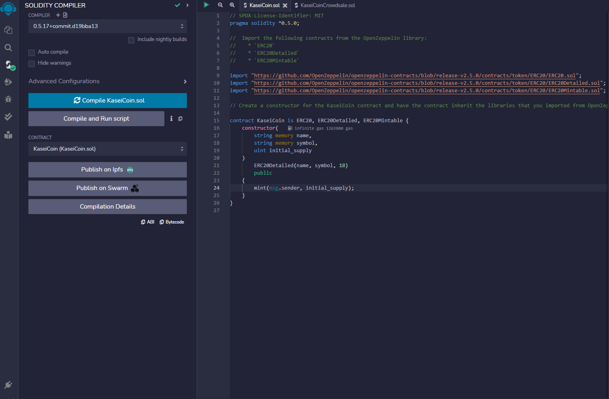
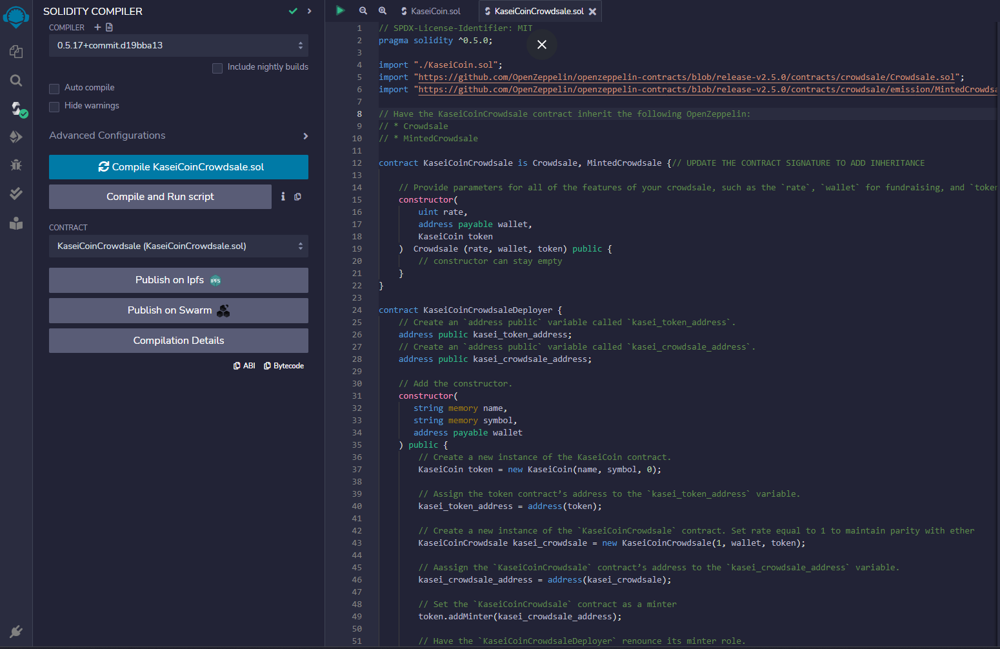
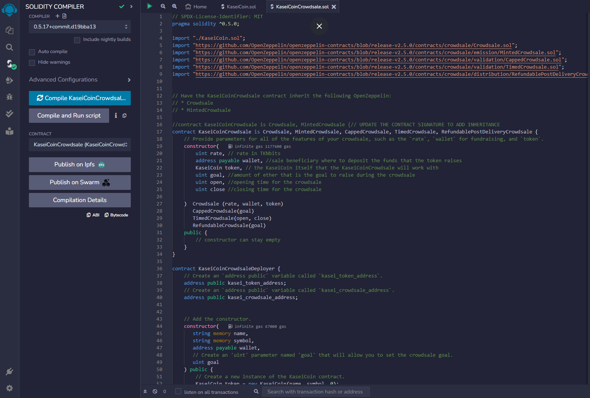
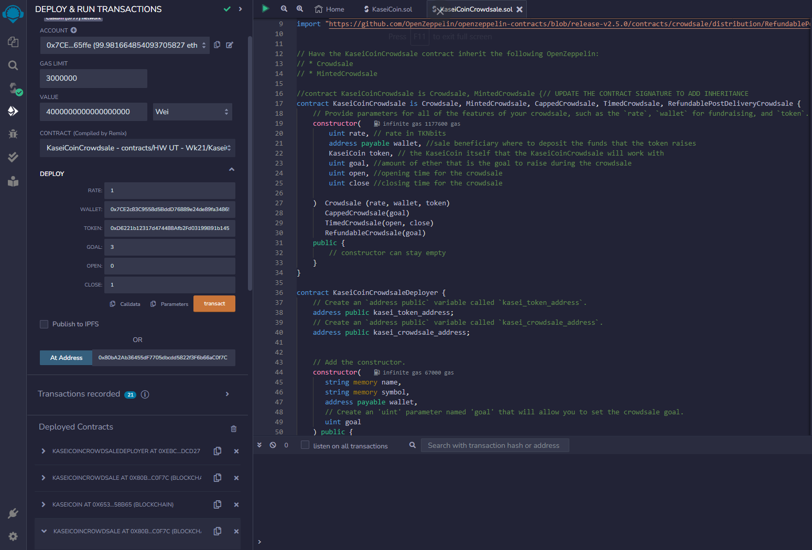
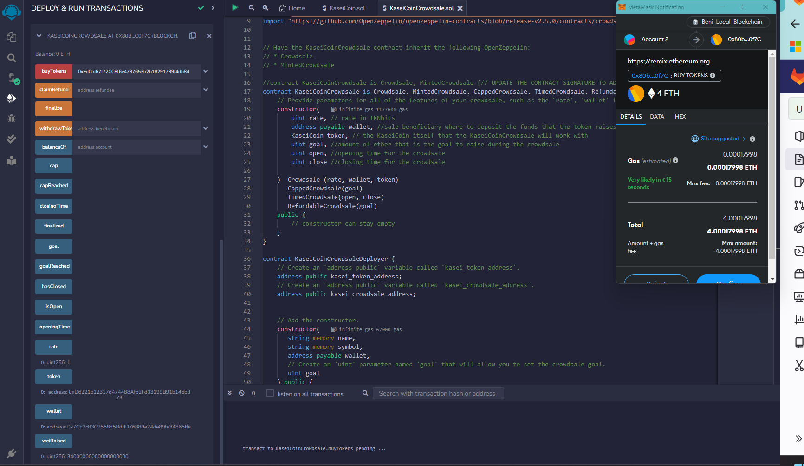
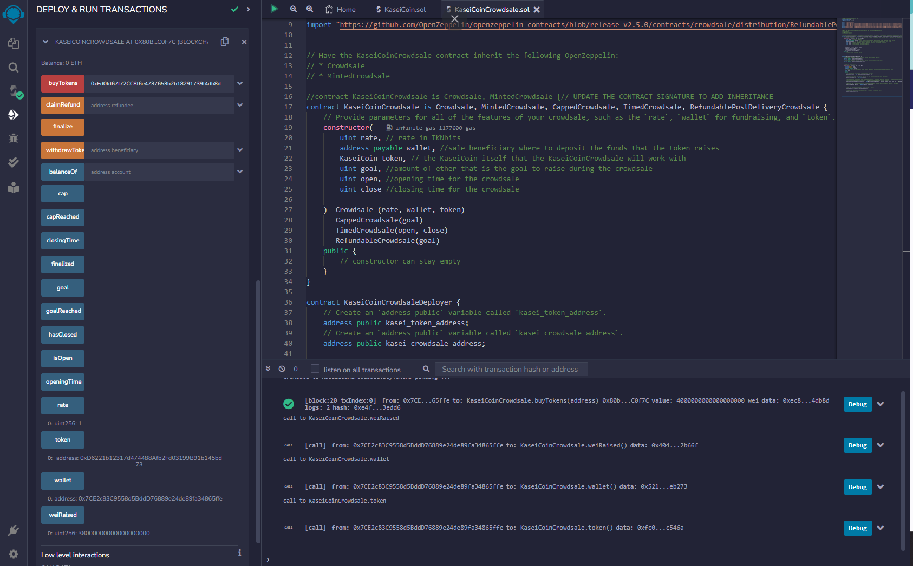
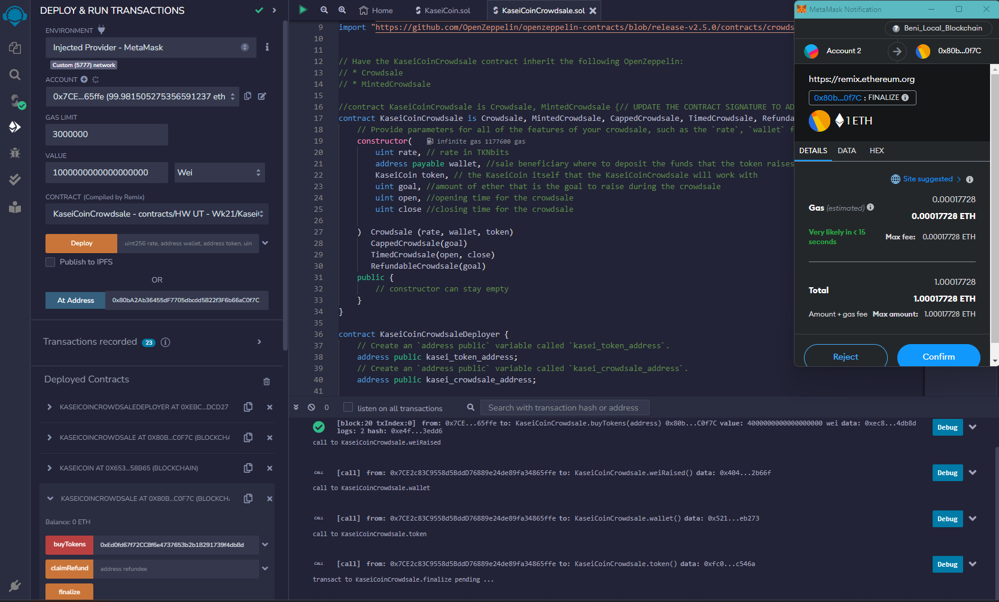

# crowdsale
Blockchain technology is used to define a new monetary system using cryptocurrency.

This new system is based on blockchain technology and defined a new cryptocurrency named KaseiCoin. KaseiCoin will be a fungible token that’s ERC-20 compliant. Here we will launch a crowdsale that will allow people to buy KaseiCoin.

 

KaseiCoin

 

Crowdsale

In this video we will run the complied code for crowdsale and then buy KaseiCoin. Finally mint the coins.

 

Enhanced version of the code has a timinig component to time the mentioned goal to be reached for th crowdsale and finalize it.

 

Results for Crowdsale in a timed way to reach the goal

